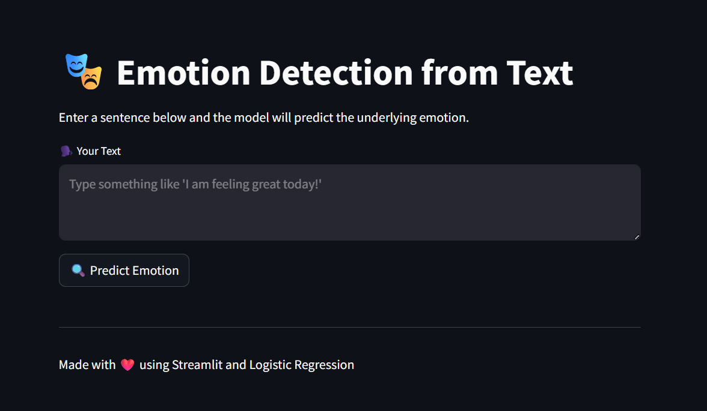

# NLP-Based Emotion Detection System

> Classifying human emotions from text using Machine Learning — deployed as a live web application.


🔗 **[Live App](https://asifshaikh-ui-emotion-prediction-app-i6jtrl.streamlit.app/)** | 📁 **[Dataset](https://www.kaggle.com/)** (Kaggle Emotions Dataset)

---

## Overview

This project builds a text-based emotion classifier that predicts one of **6 human emotions** from any input sentence or message. The model is trained using Logistic Regression on a Kaggle emotions dataset and deployed as an interactive web application using Streamlit.

The goal was to demonstrate a complete end-to-end NLP pipeline — from raw text preprocessing to a live, deployable prediction system.

---

## Live Demo

> Paste any sentence and the app instantly predicts the emotion behind it.

📌 **[Click here to try the live app →](https://asifshaikh-ui-emotion-prediction-app-i6jtrl.streamlit.app/)**

<!-- Add screenshot below -->


---

## Key Results

| Metric | Value |
|---|---|
| Model | Logistic Regression |
| Dataset | Kaggle Emotions Dataset |
| Emotions classified | 6 (joy, sadness, anger, fear, love, surprise) |
| Model accuracy | **92%** |
| Deployment | Streamlit (live) |

---

## Emotions Classified

| Emotion | Description |
|---|---|
| 😊 Joy | Happiness, excitement, positivity |
| 😢 Sadness | Grief, disappointment, sorrow |
| 😠 Anger | Frustration, rage, irritation |
| 😨 Fear | Anxiety, worry, dread |
| ❤️ Love | Affection, warmth, care |
| 😲 Surprise | Shock, amazement, disbelief |

---

## Tech Stack

| Tool | Purpose |
|---|---|
| Python | Core programming language |
| Pandas & NumPy | Data loading and preprocessing |
| Scikit-learn | Model training, TF-IDF vectorization, evaluation |
| Matplotlib | Data visualization during EDA |
| Streamlit | Web app deployment |

---

## Project Structure

```
Emotion_prediction/
│
├── app.py                  # Streamlit web application
├── model.pkl               # Trained Logistic Regression model
├── vectorizer.pkl          # Fitted TF-IDF vectorizer
├── emotion_prediction.ipynb # Full notebook: EDA, training, evaluation
├── requirements.txt        # Python dependencies
└── README.md
```

---

## How It Works

```
User Input Text
      ↓
Text Preprocessing (lowercase, remove punctuation, stopwords)
      ↓
TF-IDF Vectorization
      ↓
Logistic Regression Model
      ↓
Predicted Emotion + Confidence Score
```

---

## How to Run Locally

```bash
# 1. Clone the repository
git clone https://github.com/AsifShaikh-ui/Emotion_prediction.git
cd Emotion_prediction

# 2. Install dependencies
pip install -r requirements.txt

# 3. Run the Streamlit app
streamlit run app.py
```

---

## Author

**Asif Iqbal Shaikh**
📧 sasif9226@gmail.com
🔗 [LinkedIn](https://www.linkedin.com/in/asif-shaikh-5487a9270)
🐙 [GitHub](https://github.com/AsifShaikh-ui)
